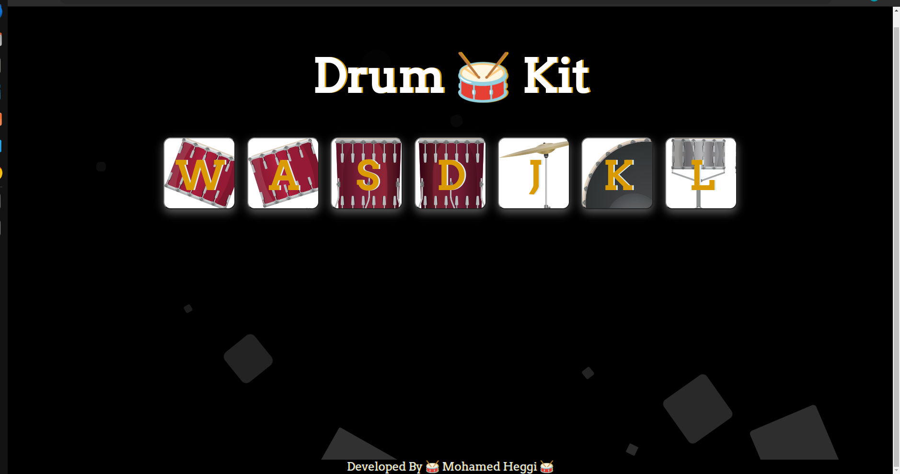

# 🥁 The-Drum-Kit 🥁
The Drum Kit project is a web application that allows users to play drum sounds by pressing corresponding keys on their keyboard or by clicking on the drum pads displayed on the screen. The application is built using HTML, CSS, and JavaScript, and features animations and sound effects to enhance the user experience. The project is designed to be easy to use and accessible to users of all skill levels.

## Deployment

Deployed Website: [not deployed yet-- Deploy when repo go public]

## Demo Video 

<video width="320" height="240" controls>
    <source src="./demo/demo.mp4" type="video/mp4">
</video>

## Built With

  * HTML
  * CSS
  * JavaScript

## Acknowledgments
  * The Complete 2021 Web Development Bootcamp by Angela Yu
  * CodePen for animated back ground